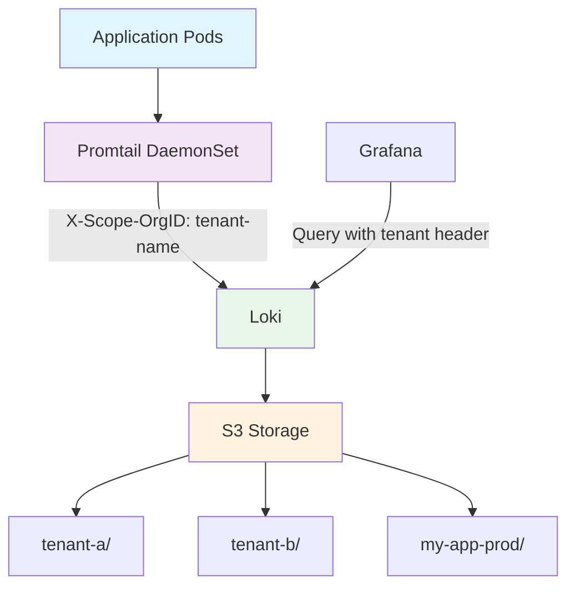

When managing logs at scale in Kubernetes environments, proper tenant isolation becomes crucial for security, compliance, and organizational clarity. This comprehensive guide walks you through implementing **true multi-tenancy** with Grafana Loki, where logs are physically separated into different S3 directories based on tenant IDs.

**What You'll Learn:**
- How to configure Loki for multi-tenant log storage in S3
- Proper Promtail configuration for tenant header injection
- Troubleshooting common pitfalls and misconfigurations
- Security best practices for production deployments

**Real-World Impact:**
By the end of this guide, your logs will be organized like this in S3:

```
s3://your-loki-bucket/
├── tenant-a/
│   ├── logs_chunk_xyz/
│   └── logs_index_abc/
├── tenant-b/
│   ├── logs_chunk_def/
│   └── logs_index_ghi/
└── my-app-prod/
    ├── logs_chunk_jkl/
    └── logs_index_mno/
```

## Understanding Multi-Tenancy

In default Loki configurations with `auth_enabled: false`, all logs are stored under a hardcoded "fake" tenant directory:

```
s3://bucket/fake/hash-based-folders/
```

**Problems with single-tenant setups:**
- ❌ No logical separation between different applications
- ❌ Difficult to implement access controls
- ❌ Compliance challenges for sensitive data
- ❌ No way to scan specific application logs for security issues

**Benefits of proper multi-tenancy:**
- ✅ **Physical separation**: Each tenant gets its own S3 directory
- ✅ **Access control**: Fine-grained permissions per tenant
- ✅ **Compliance**: Easy auditing and data governance
- ✅ **Scalability**: Independent retention policies per tenant
- ✅ **Security**: Isolated log scanning for sensitive data

## Architecture Overview



### Key Components

1. **Loki**: Log aggregation server with `auth_enabled: true`
2. **Promtail**: Log shipper that adds tenant headers to log streams
3. **S3 Storage**: Object storage with tenant-based directory structure
4. **Grafana**: Optional UI for querying logs with tenant context

## Prerequisites

- Kubernetes cluster (1.24+)
- Helm 3.x
- AWS S3 bucket with appropriate IAM permissions
- Basic understanding of Kubernetes networking

**Required IAM Permissions:**
```json
{
    "Version": "2012-10-17",
    "Statement": [
        {
            "Effect": "Allow",
            "Action": [
                "s3:ListBucket",
                "s3:GetObject",
                "s3:PutObject",
                "s3:DeleteObject"
            ],
            "Resource": [
                "arn:aws:s3:::your-loki-bucket",
                "arn:aws:s3:::your-loki-bucket/*"
            ]
        }
    ]
}
```

## Configuration Setup

### Loki Configuration

The foundation of multi-tenancy starts with Loki configuration:

```yaml
# values.yaml for loki-stack helm chart
loki:
  enabled: true
  config:
    # CRITICAL: Enable authentication for multi-tenancy
    auth_enabled: true
    # Schema configuration for S3
    schema_config:
      configs:
        - from: "2024-05-01"
          store: tsdb
          object_store: s3
          schema: v12
          index:
            prefix: logs_
            period: 24h
          chunks:
            prefix: logs_chunk_
            period: 24h
    # Storage configuration
    storage_config:
      aws:
        bucketnames: your-loki-storage-bucket
        region: eu-west-1
        s3forcepathstyle: false
      tsdb_shipper:
        active_index_directory: "/data/tsdb-index"
        cache_location: "/data/tsdb-cache"
        shared_store: s3
    # Server configuration
    server:
      http_listen_port: 3100
      grpc_listen_port: 9095
    # Limits configuration
    limits_config:
      enforce_metric_name: false
      max_entries_limit_per_query: 5000
      max_query_lookback: "90d"
      reject_old_samples: true
      reject_old_samples_max_age: "168h"
      retention_period: "100d"
```

### Promtail Configuration

**The Critical Component**: Promtail must inject the correct tenant headers:

```yaml
promtail:
  enabled: true
  config:
    clients:
      - url: http://loki:3100/loki/api/v1/push
        tenant_id: "my-app-prod"
        headers:
          X-Scope-OrgID: "my-app-prod"  # This is CRUCIAL!
    snippets:
      extraServerConfigs: |
        health_check_target: false
      extraRelabelConfigs:
        - action: "keep"
          regex: "my-app-.*"  # Only collect from pods with app=my-app-*
          source_labels:
            - "__meta_kubernetes_pod_label_app"
```

### Grafana Configuration (Optional)

For viewing logs in Grafana UI:

```yaml
grafana:
  enabled: true
  adminPassword: "admin"
  # Additional datasource config removed as it's not required for storage
  ingress:
    enabled: true
    ingressClassName: "alb"
    hosts:
      - grafana.your-domain.com
```

## Implementation Steps

### 1. Deploy the Initial Configuration

```bash
# Add Grafana Helm repository
helm repo add grafana https://grafana.github.io/helm-charts
helm repo update

# Deploy with multi-tenant configuration
helm install loki grafana/loki-stack \
  --namespace monitoring \
  --create-namespace \
  --values values.yaml
```

### 2. Verify Pod Status

```bash
# Check all components are running
kubectl get pods -n monitoring

# Expected output:
# loki-0                          1/1     Running
# loki-promtail-xxxxx             1/1     Running
# loki-grafana-xxxxx              2/2     Running
```

### 3. Validate Configuration

```bash
# Check Loki configuration
kubectl exec -n monitoring loki-0 -- cat /etc/loki/loki.yaml | grep auth_enabled
# Should show: auth_enabled: true

# Check Promtail configuration
kubectl exec -n monitoring loki-promtail-xxxxx -- cat /etc/promtail/promtail.yaml | grep -A 5 "clients:"
# Should show tenant_id and X-Scope-OrgID header
```

### 4. Test Log Generation

Deploy a test application with the correct labels:

```yaml
apiVersion: apps/v1
kind: Deployment
metadata:
  name: my-app-log-test
  labels:
    app: my-app-test
spec:
  replicas: 1
  selector:
    matchLabels:
      app: my-app-test
  template:
    metadata:
      labels:
        app: my-app-test  # This matches promtail filter
    spec:
      containers:
      - name: log-generator
        image: busybox
        command: ["/bin/sh", "-c"]
        args:
          - |
            while true; do
              echo "$(date) [INFO] Multi-tenant test log entry"
              sleep 10
            done
```

### 5. Verify S3 Structure

After 2-3 minutes:

```bash
# Check for tenant directory creation
aws s3 ls s3://your-loki-bucket/

# Expected output should include:
# PRE my-app-prod/

# Check tenant-specific logs
aws s3 ls --recursive s3://your-loki-bucket/my-app-prod/ | head -5
```

## Troubleshooting

**Common Issues and Solutions:**

**1. Logs Still Going to "fake" Directory:**
- **Problem**: S3 shows `fake/` directory instead of tenant directories
- **Solution**: Ensure both `tenant_id` and `X-Scope-OrgID` header are configured, and `auth_enabled: true`

**2. No Logs Being Collected:**
- **Problem**: No new files in S3, Promtail running but not shipping logs
- **Solution**: Check pod labels match promtail regex filter, verify Promtail configuration

**3. TSDB Schema Errors:**
- **Problem**: Loki pods crashing with "invalid schema version"
- **Solution**: Use supported schema versions (v12, not v13)

**4. Ingress Configuration Conflicts:**
- **Problem**: Terraform/Helm apply fails with ingress validation errors
- **Solution**: Ensure consistent ingress configuration with matching annotations

## Best Practices

**Tenant Naming Convention:**
- Use consistent, lowercase tenant names
- Include environment prefixes: `prod-`, `staging-`, `dev-`
- Examples: `my-app-prod`, `auth-service-staging`

**Security Configuration:**
- Restrict log collection to specific namespaces
- Use proper resource limits and requests
- Implement retention policies per log level

**Resource Management:**
- Allocate appropriate memory and CPU resources
- Set up monitoring and alerting
- Use proper retention policies for different log types

## Security & Performance

**S3 Bucket Security:**
- Enable S3 bucket encryption at rest
- Use least-privilege IAM policies
- Enable S3 access logging
- Consider S3 bucket policies for additional restrictions

**Network Security:**
- Limit Loki ingress to cluster-internal traffic
- Use network policies to restrict access
- Implement proper firewall rules

**Sensitive Data Protection:**
- Implement log scrubbing in application code
- Use promtail pipeline stages to filter sensitive data
- Regular security audits and monitoring

**Performance Optimization:**
- Use daily indices for better performance
- Configure appropriate query limits and timeouts
- Optimize index and chunk configurations

**Monitoring and Alerting:**
- Monitor Loki ingestion rate and S3 upload success
- Set up alerts for query performance issues
- Track key metrics: `loki_distributor_ingester_appends_total`, `loki_boltdb_shipper_uploads_total`

## Conclusion

Implementing multi-tenancy with Loki provides significant benefits for log management at scale. The key success factors are:

1. **Proper Configuration**: Enable `auth_enabled: true` and configure tenant headers
2. **Header Injection**: Ensure Promtail sends `X-Scope-OrgID` headers
3. **Testing**: Validate tenant separation in S3 storage
4. **Security**: Implement proper access controls and data protection

**Key Takeaways:**
- ✅ Multi-tenancy requires `auth_enabled: true` in Loki
- ✅ Promtail must send both `tenant_id` and `X-Scope-OrgID` header
- ✅ Physical tenant separation occurs automatically in S3
- ✅ Grafana datasource configuration is optional for storage
- ✅ Always test with real log generation to verify setup

**Next Steps:**
1. Implement log retention policies per tenant
2. Set up monitoring and alerting for log ingestion
3. Consider implementing log forwarding for compliance
4. Explore advanced features like log sampling and rate limiting

---

**About the Author**

This guide was created based on real-world implementation experience with Loki multi-tenancy in production Kubernetes environments. For questions or improvements, please open an issue in the repository.

**License**

This documentation is released under MIT License.
